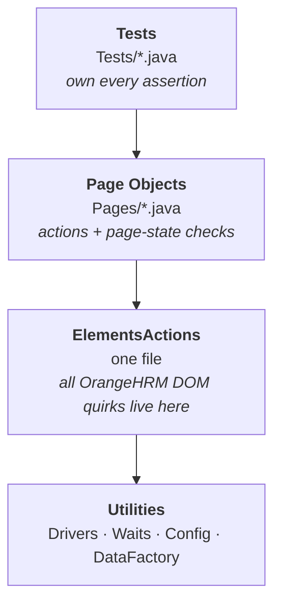

# Walkthrough — how this framework works, and why

A single page to hold the whole repo in your head. Read top to bottom once; after that
the section headings are enough.

**Size check:** 32 Java files, ~3,460 lines, 19 tests. That sounds like a lot until you see
that 10 of those files are page objects (one per screen) and 6 are throwaway debugging
probes. There is no dead code — every class and every public method is called by something.

---

## 1. The 30-second answer

> "It's a Selenium 4 + TestNG framework using the Page Object Model, with Allure reporting.
> Four layers: tests assert, page objects express intent, a shared actions layer absorbs the
> application's DOM quirks, and utilities own the driver, waits and config. The application
> under test is OrangeHRM 5.9, which is a Vue single-page app on a shared public demo — so
> most of the engineering in here is about making tests deterministic against a UI that
> re-renders under you and a database other people are editing at the same time."

That paragraph answers about half of what you'll be asked. Everything below is the detail
behind it.

---

## 2. The four layers



**The rule that keeps it clean: pages assert *page state*, tests assert *business outcomes*.**

A page may say "this screen loaded" — `verifyAddEmployeePageLoaded()` — because that is a fact
about the page itself, and every caller wants the same answer.

A page must **not** say "the employee was created", because different callers want different
answers. `PimEmployeeListPage.findRowByLastName()` returns an `Optional<EmployeeRow>` rather
than asserting: the positive test wants *"it's there"*, the cleanup routine wants *"is it still
there? if not, fine, move on"*, and a negative test wants *"it must NOT be there"*. One
assertion baked into the page would fight two of those three callers.

**Why `ElementsActions` exists.** Without it, every OrangeHRM workaround would be copy-pasted
across 10 page objects. Instead: one method, one place to fix it. This is the file to open if
an interviewer asks "show me something you're proud of."

---

## 3. The six files that matter

If you only revise six, revise these.

| File | Its one job | The thing to remember |
|---|---|---|
| `Util/ElementsActions.java` | Every interaction with the app | Every OrangeHRM quirk is here, each with a comment saying *why* |
| `Util/Waits.java` | Every wait | **Zero implicit waits.** All explicit. Mixing the two makes timeouts unpredictable |
| `Util/Drivers.java` | Driver lifecycle | `ThreadLocal` so `parallel="classes"` works; Selenium Manager means no driver binaries |
| `Util/Config.java` | Configuration | 3-tier: system property → env var → config.yaml |
| `Pages/BasePage.java` | Shared page behaviour | Navigation, toast capture, field-error reading, label-based locators |
| `Tests/BaseTest.java` | Lifecycle + test data | Driver per **class**, login, and cleanup of everything created |

Everything else is an application of these six.

### Conventions used everywhere

Every page object is laid out in the same three sections, so anything is findable in seconds:

```java
public class AddEmployeePage extends BasePage {

    //Locators
    private final By firstNameField = By.name("firstName");

    //PageActions
    public AddEmployeePage enterFirstName(String firstName) { ... }

    //PageAssertions
    public void verifyAddEmployeePageLoaded() {
        Validations.validateTrue(..., "Add Employee form did not load");
    }
}
```

- **Comments** — code says *what*, so a comment only ever explains *why*, and only where the
  reason is non-obvious (the `yyyy-dd-MM` date format, the `ORANGEHRM_` env prefix). Test
  intent lives in `@Description`, which also reaches the Allure report.
- **Assertions** go through `Validations`, so every failure message reads the same way.
- **Test data** is never a literal in a test — it comes from `data.json` via `DataFactory`.
- **Config** is never a literal either — `Config.getInstance()`, backed by `config.yaml`.
- **Test names** read as sentences: `verifyUserCanCreateNewEmployee`.

---

## 4. Full file map — one line each

**`src/main/java/Util/` — the plumbing (9 files)**

| File | Does |
|---|---|
| `Drivers` | Creates/quits Chrome, Firefox or Edge in a `ThreadLocal`. Headless flag. No implicit wait. |
| `Waits` | All explicit waits + `waitForLoaderToDisappear` + `retryOnStale`. Ignores `StaleElementReference`. |
| `ElementsActions` | Click, type, dropdowns, autocompletes, dates, toasts. The quirk vault. |
| `DataFactory` | Builds unique employees from `data.json` + the run tag, and calculates leave dates. |
| `Config` | Singleton over `config.yaml`, with `-D` and env-var overrides. |
| `Helper` | Reads a value out of `TestData/data.json`. |
| `Validations` | Thin wrapper over TestNG `Assert`, so assertions read the same everywhere. |
| `ScreenshotUtil` | Saves a PNG to disk and attaches it to Allure. |
| `Scrolling` | Scrolls an element into view. Used only by `ElementsActions`. |

**`src/main/java/Pages/` — one class per screen (10 files)**

| File | Screen |
|---|---|
| `BasePage` | Abstract parent — navigation, toasts, field errors, `inputByLabel`/`dropdownByLabel` |
| `LoginPage` | Login |
| `DashboardPage` | Post-login landing |
| `PimEmployeeListPage` | PIM → Employee List (search, filter, results table, delete) |
| `AddEmployeePage` | PIM → Add Employee |
| `EmployeeDetailsPage` | The record: Personal Details + Job tabs |
| `ApplyLeavePage` | Leave → Apply |
| `AssignLeavePage` | Leave → Assign Leave |
| `LeaveEntitlementPage` | Leave → Entitlements → Add |
| `LeaveListPage` | Leave → Leave List |

**`src/test/java/` — the tests (19 across 4 classes)**

| Class | Covers | Tests |
|---|---|---|
| `LoginTest` | Login screen + valid login | 2 |
| `EmployeeTest` | Assessment steps 2–7: search, create, verify, edit, persist, filter, reset | 9 |
| `LeaveTest` | Step 8: entitlement → assign leave → find it in the list | 4 |
| `NegativeTest` | Required field, over-length input, invalid date range, bad credentials | 4 |

**`Listeners/`** — `TestListener` (screenshot on failure, Allure attachment) and `RetryAnalyzer`
(retries once, applied **per test**, never suite-wide — see §6).

**`Tools/`** — six standalone probes (`LocatorProbe`, `DropdownProbe`, `AutocompleteProbe`,
`FormProbe`, `LeaveTypeProbe`, `LeaveRouteProbe`). **These are not tests.** No suite runs
them. They dump the real DOM so locators are read off the running app instead of guessed.
If asked: *"I don't guess locators. When something didn't match I wrote a probe that printed
the actual DOM, then fixed the locator against evidence."*

---

## 5. Trace one test end to end

`LeaveTest.verifyUserCanSubmitLeaveRequest()` — the most representative path in the repo:

1. `BaseTest.setUp()` — `@BeforeClass` — builds the driver, opens the login page.
2. `LeaveTest.signIn()` — logs in, generates the employee, calculates dates, and **probes for
   a 403** on the Leave module (§6).
3. `verifyUserCanCreateEmployeeWithLeaveEntitlement()` — creates the employee, registers it for cleanup,
   grants 10 days of entitlement.
4. `verifyUserCanSubmitLeaveRequest()` — the test itself:
   - `new AssignLeavePage().open()` → `BasePage.openPath()` → waits for the app shell, then
     the loader.
   - `assign.selectEmployee(...)` → `BasePage.selectEmployeeByName()` → types the **last name
     token only** → `ElementsActions.selectFromAutocomplete()` → waits past `Searching....`
   - `assign.setFromDate(date)` → `ElementsActions.setDate()` → types in `yyyy-dd-MM` and
     sends `ESCAPE` to close the picker.
   - `assign.clickAssign()` → clicks, then **immediately** `captureToast()`.
   - The test asserts `wasLastActionSuccessful()`. **The assertion is in the test, not the page.**
5. `verifySubmittedLeaveCanBeFound()` — reopens Leave List and finds the record, proving it was
   *persisted*, not merely announced by a toast.
6. `BaseTest.tearDown()` — `@AfterClass` — deletes the created employee, then quits the driver.

---

## 6. The decisions you'll be asked to defend

**Why TestNG and not Cucumber?**
The brief specified CLI execution by class, method, group and suite file. TestNG does all four
natively. Cucumber would have added a Gherkin layer with no reader to benefit from it.

**Why one driver per *class*, not per method?**
The scenarios are a journey — create, find, edit, prove it persisted. A per-method driver would
re-login nine times and lose the thread of the journey. Methods are chained with
`dependsOnMethods`, so a broken precondition **skips** downstream tests instead of producing a
second misleading failure.

**Why no implicit waits at all?**
Mixing implicit and explicit waits makes timeouts unpredictable — the implicit wait silently
inflates every explicit one. All waits here are explicit, in `Waits.java`.

**Why is the retry applied per-test instead of suite-wide?**
I tried suite-wide first and it made things worse. Re-running a test that had already created
an employee hit the duplicate-Employee-Id validation, so the form never navigated — a transient
blip became a confusing failure with an unrelated message. Retry is only safe where the test is
idempotent, so it's attached only to read-only tests.

**Why does `Config` prefix environment variables with `ORANGEHRM_`?**
Because an unprefixed lookup collided with the OS. On Windows `%USERNAME%` is the logged-in
account, so a bare `USERNAME` lookup silently resolved to *my own login* and every test failed
with "Invalid credentials". Genuinely my favourite bug in the repo.

**How do you handle the shared demo environment?**
Three ways. (1) Every record is uniquely named with a run tag, so parallel users can't collide.
(2) Everything created is deleted in `@AfterClass`, and cleanup searches by **last name** —
because the edit test changes the first name, so a full-name lookup would find nothing,
conclude the record was gone, and quietly leave it behind. (3) Assertions that depend on
row counts use a tolerance plus a positive proof, not exact equality — the count moved from
114 to 252 between runs because other people were using the same database.

**Why do some tests skip with a message about 403?**
The demo's Admin role is edited by other users; the Leave module can be revoked between runs.
Without an explicit check, every Leave test burns its full timeout and then reports a missing
button — which reads like a broken locator or a product defect. Detecting the 403 turns that
into an accurate, immediate statement: *this is an environment permission state, not a failure.*

**Why is `verifyUserCanCreateEmployeeWithLeaveEntitlement` in both the smoke and regression groups?**
Because `verifyUserCanSubmitLeaveRequest` is a smoke test and depends on it, and TestNG refuses to run a
group whose members depend on excluded methods. **A group must be closed over its dependencies.**
`-Dgroups=smoke` ran zero tests until I fixed this.

---

## 7. The war stories (these are what actually impress)

Each of these is a real bug I hit and fixed. Pick two or three.

| Symptom | Real cause |
|---|---|
| Autocomplete never matched an employee that clearly existed | OrangeHRM's placeholder is `Searching....` — **four dots**. My exact match on three never fired. Now a prefix match. |
| Every test failed "Invalid credentials" | Windows `%USERNAME%` shadowed my config lookup. Fixed with the `ORANGEHRM_` prefix. |
| Success toast "not displayed" although the save worked | Toasts auto-dismiss. I was looking *after* waiting for the loader. Now captured immediately after the click. |
| Search returned 0 rows although it worked in the browser | A leftover "No Records Found" **toast** satisfied my no-results check. Now toasts are dismissed before searching, and the check requires *visible* markers. |
| `ElementNotInteractable` on the Leave Type dropdown | I was sending `ESCAPE` to a `div`. Fixed with `Actions`. |
| Employee Id read as `""` right after creation | Personal Details renders inputs empty, then populates. Added a `waitForRecordToLoad()` gate. |
| Leave types list came back empty | The list only populates *after* an employee is chosen. Reordered the steps. |
| Allure showed no step detail on Java 25 | AspectJ weaver < 1.9.24 aborts with `Unsupported class file major version 69` — silently. Bumped to 1.9.24. |
| `verifyResetRestoresFullResultSet` expected 252, found 254 | Other people creating employees mid-run. Replaced exact equality with a tolerance plus proof that an excluded employee reappears. |

**The habit behind all of these:** classify before fixing — *product defect*, *test defect*, or
*environment*. A green suite bought by weakening an assertion is worse than a red one.

---

## 8. Running it

```bash
mvn clean test                                    # everything
mvn test -Dtest=EmployeeTest                      # one class
mvn test -Dtest=EmployeeTest#verifyUserCanCreateNewEmployee    # one method
mvn test -DsuiteXmlFile=suites/smoke.xml          # one suite file
mvn test -Dgroups=smoke                           # one group
mvn allure:serve                                  # open the report
```

All five forms coexist because of a Maven profile activated by the *presence* of the
`suiteXmlFile` property — otherwise configuring `suiteXmlFiles` in Surefire would permanently
override `-Dtest`.

---

## 9. What I'd do next

Honest answers to "what would you improve?":

- **CI.** A GitHub Actions workflow running the smoke group per PR and publishing Allure history.
- **A stable environment.** Every tolerance and skip in here is compensating for a shared
  sandbox. Against a controlled instance, those become exact assertions.
- **API-level setup.** Creating an employee through the UI to test *leave* is slow and fragile;
  seeding via API would cut the leave suite's runtime and its failure surface.
- **Parallelism.** The `ThreadLocal` driver already supports `parallel="classes"`; it's off
  only because the shared demo throttles under load.
